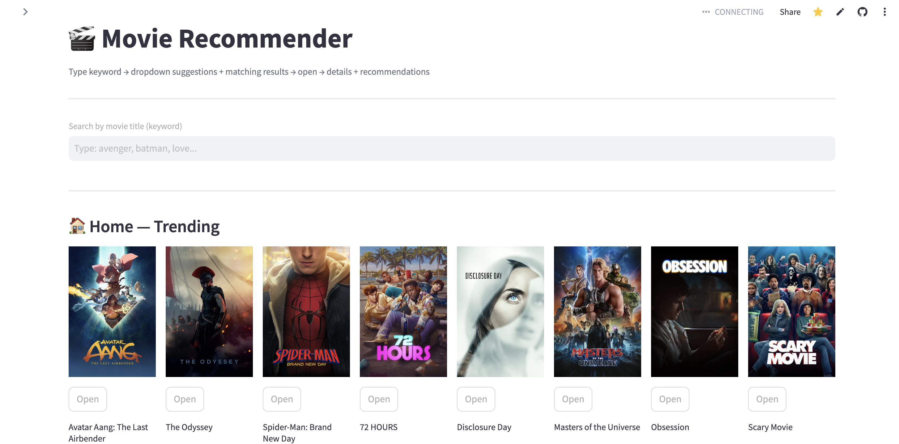
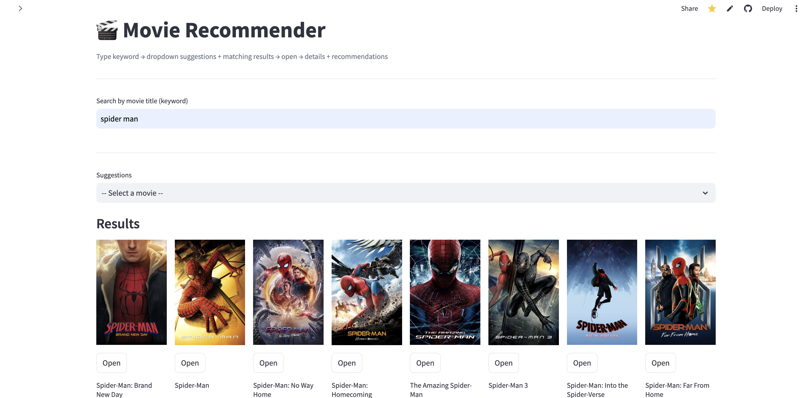
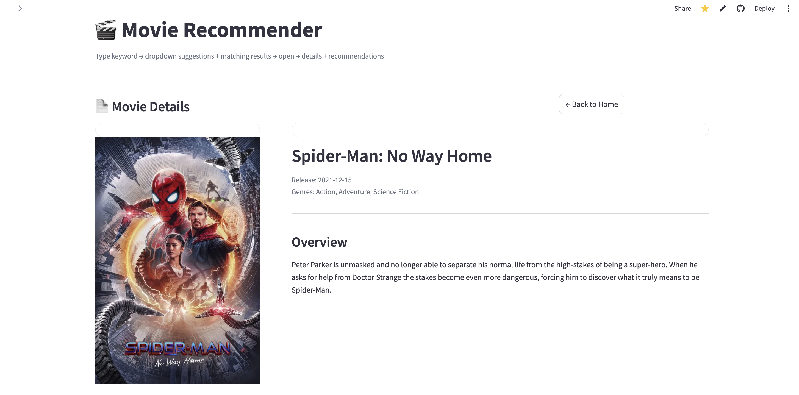
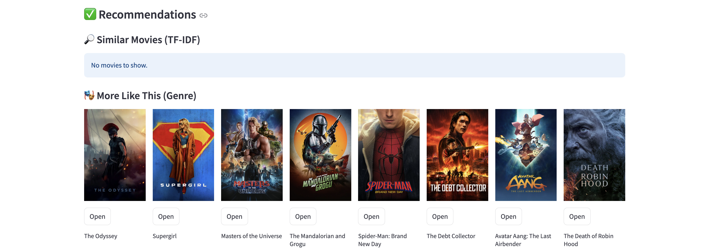

# 🎬 Movie Recommendation System

<p align="center">
  
  
  
  
  
  
  
  
</p>

---

# 📌 Project Overview

The **Movie Recommendation System** is an end-to-end Machine Learning application that recommends movies based on their content using Natural Language Processing (NLP).

The system analyzes movie metadata such as genres and overviews, converts textual information into numerical vectors using **TF-IDF Vectorization**, and identifies similar movies using **Cosine Similarity**.

The application integrates with the **TMDB API** to retrieve movie posters, ratings, release dates, genres, cast information, trailers, and additional movie details.

The project demonstrates an end-to-end Machine Learning workflow including data preprocessing, feature engineering, NLP, recommendation systems, REST API development, cloud deployment, and an interactive Streamlit frontend.

---

# 🚀 Features

- 🎬 Search movies by title
- 🤖 Content-Based Movie Recommendations
- 🧠 TF-IDF Vectorization
- 📊 Cosine Similarity Recommendation Engine
- 🖼️ Movie Posters from TMDB
- ⭐ Ratings & Popularity
- 🎭 Genres
- 📅 Release Date
- 📝 Movie Overview
- 🎥 Trailer & Movie Details
- ⚡ FastAPI Backend
- 🌐 Streamlit Frontend
- ☁️ Render Deployment

---

# 🏗️ System Architecture

```text
                  Movie Dataset
                        │
                        ▼
             Data Cleaning & Preprocessing
                        │
        ┌───────────────┴────────────────┐
        │                                │
        ▼                                ▼
     Genres                       Movie Overview
        │                                │
        └───────────────┬────────────────┘
                        ▼
             Text Preprocessing (NLP)
      Lowercase • Stopwords • Lemmatization
                        │
                        ▼
               TF-IDF Vectorization
                        │
                        ▼
              Cosine Similarity Matrix
                        │
                        ▼
           Recommendation Engine (FastAPI)
                        │
             TMDB API Integration
                        │
                        ▼
            Streamlit Interactive Web App
```

---

# 🛠️ Tech Stack

## Programming Language

- Python 3.11

## Machine Learning

- Scikit-Learn
- TF-IDF Vectorizer
- Cosine Similarity

## NLP

- Text Preprocessing
- Stopword Removal
- Lemmatization

## Backend

- FastAPI
- Uvicorn

## Frontend

- Streamlit

## APIs

- TMDB API

## Data Processing

- Pandas
- NumPy

## Deployment

- Render
- Streamlit Community Cloud

---

# 📂 Project Structure

```text
Movie-Recommendation-System/
│
├── backend/
│   ├── main.py
│   ├── requirements.txt
│   ├── runtime.txt
│   ├── df.pkl
│   ├── indices.pkl
│   ├── tfidf.pkl
│   ├── tfidf_matrix.pkl
│   └── .env.example
│
├── frontend/
│   ├── app.py
│   └── requirements.txt
│
├── README.md
├── .python-version
└── .gitignore
```

---

# 💡 Workflow

1. User searches for a movie.
2. FastAPI receives the request.
3. TF-IDF vectors are loaded.
4. Cosine Similarity identifies similar movies.
5. TMDB API fetches posters and movie metadata.
6. FastAPI returns recommendation results.
7. Streamlit displays recommendations interactively.

---

# 📸 Application Preview

## 🏠 Home Page

<p align="center">

</p>

---

## 🔍 Search Movies

<p align="center">

</p>

---

## 🎬 Movie Details

<p align="center">

</p>

---

## 🤖 Recommendations

<p align="center">

</p>

---

# 🌐 Live Demo

## Streamlit

- Streamlit: https://movie-recommendation-system-wuptgjycnmeier4gfz3cdh.streamlit.app/

---

# 🔮 Future Enhancements

- Collaborative Filtering
- Hybrid Recommendation System
- User Authentication
- Watchlist Management
- Personalized Recommendations
- Trending Movies
- Similar Actor Recommendations
- Genre Analytics Dashboard
- Movie Review Sentiment Analysis
- User Rating Prediction

---

# 🎯 Skills Demonstrated

- Python
- Machine Learning
- Recommendation Systems
- Natural Language Processing (NLP)
- TF-IDF Vectorization
- Cosine Similarity
- FastAPI
- REST APIs
- Streamlit
- TMDB API Integration
- Data Preprocessing
- Pandas
- Scikit-Learn
- Deployment (Render & Streamlit)
- Git & GitHub

---

# 📄 License

This project is licensed under the MIT License.

---

# 👨‍💻 Author

**Kedar Sankpal**

- GitHub: https://github.com/Kedar14-byte
- LinkedIn: https://www.linkedin.com/in/kedar-sankpal14/

---

## ⭐ If you found this project useful, please consider giving it a Star!